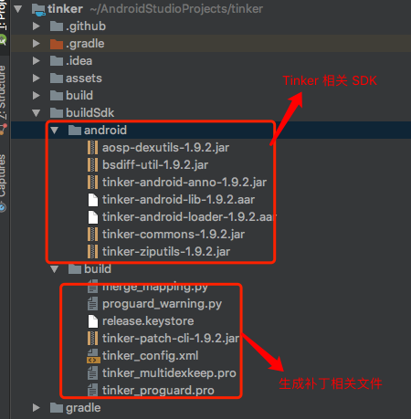

### <i class="fa fa-rebel fa-1x" aria-hidden="true"></i>  概述
&nbsp;&nbsp;&nbsp;&nbsp;&nbsp;&nbsp;&nbsp;&nbsp;
Tinker 源码地址 [https://github.com/Tencent/tinker](https://github.com/Tencent/tinker)，作为热修复框架，支持修复代码、So库以及资源，让应用能够在不需要重新安装的情况下实现更新。
### <i class="fa fa-rebel fa-1x" aria-hidden="true"></i> 基本使用
##### <i class="fa fa-star" aria-hidden="true"></i> 生成补丁
&nbsp;&nbsp;&nbsp;&nbsp;&nbsp;&nbsp;&nbsp;&nbsp;
生成补丁的方式官方给出了两种方式，1、gradle 集成，通过 gradle 命令直接生成；2、patch 生成工具。这里主要介绍下 patch 生成工具的用法：
patch 生成工具，实则是一个 jar 文件，可以通过 java -jar 来执行这个文件。

+ 工具的生成
&nbsp;&nbsp;&nbsp;&nbsp;&nbsp;&nbsp;&nbsp;&nbsp;工具是通过 tinker-build目录下的 tinker-patch-cli 工程生成的，通过运行该工程下的 assemble 命令即可生成 tinker-patch-cli.jar 文件在 build/libs目录下，或者直接执行改目录下的buildTinkerSdk命令(建议使用此命令)，生成文件如下：


+ 工具的使用

1. 替换 build 目录下的 keystore 为自己的 keystore
2. 修改 tinker_config.xml文件中

```
    <issue id="dex">
        <!--only can be 'raw' or 'jar'. for raw, we would keep its original format-->
        <!--for jar, we would repack dexes with zip format.-->
        <!--if you want to support below 14, you must use jar-->
        <!--or you want to save rom or check quicker, you can use raw mode also-->
        <dexMode value="jar"/>

        <!--what dexes in apk are expected to deal with tinkerPatch-->
        <!--it support * or ? pattern.-->
        <pattern value="classes*.dex"/>
        <pattern value="assets/secondary-dex-?.jar"/>

        <!--Warning, it is very very important, loader classes can't change with patch.-->
        <!--thus, they will be removed from patch dexes.-->
        <!--you must put the following class into main dex.-->
        <!--Simply, you should add your own application {@code tinker.sample.android.SampleApplication}-->
        <!--own tinkerLoader {@code SampleTinkerLoader}, and the classes you use in them-->
        <loader value="com.tencent.tinker.loader.*"/>
        <loader value="Application全路径"/>
    </issue>
```
```
    <!--sign, if you want to sign the apk, and if you want to use 7zip, you must fill in the following data-->
    <issue id="sign">
        <!--the signature file path, in window use \, in linux use /, and the default path is the running location-->
        <path value="签名文件路径"/>
        <!--storepass-->
        <storepass value="签名密码"/>
        <!--keypass-->
        <keypass value="签名密码"/>
        <!--alias-->
        <alias value="签名别名"/>
    </issue>
```
相关信息。

3. 使用 `java -jar " + tinker-patch-cli.jar + " " + -old + " old.apk " + -new + " new.apk " + -config + " tinker_config.xml " + -out + " output_path"` 即可在 output_path 的目录下生成已签名的补丁包。

说明：tinker_multidexkeep.pro 文件是为了确保 Tinker 相关类被打包到主 dex 中，如果项目中使用到了 mulidex，需要使用此 keep 文件的内容。tinker_proguard.pro 防混淆。

##### <i class="fa fa-star" aria-hidden="true"></i> 集成Tinker

1.创建 application 使之继承 TinkerApplication，重载构造方法，调用其父类构造方法
```java
protected TinkerApplication(int tinkerFlags, String delegateClassName) {
    this(tinkerFlags, delegateClassName, TinkerLoader.class.getName(), false);
}
```
delegateClassName需继承ApplicationLike 的类名，其作用充当 Application 使用。
2.在delegateClassName理中安装 Tinker
```java
TinkerInstaller.install(this);
Tinker tinker = Tinker.with(getApplication()) ;
tinker.install(getTinkerResultIntent());
```
3.后台获取补丁文件调用
```java
TinkerInstaller.onReceiveUpgradePatch(getApplicationContext(), pathLocation);
```

### <i class="fa fa-rebel fa-1x" aria-hidden="true"></i> 源码分析
##### <i class="fa fa-star" aria-hidden="true"></i> 合并补丁
&nbsp;&nbsp;&nbsp;&nbsp;&nbsp;&nbsp;&nbsp;&nbsp;
补丁是被编译成 apk，同时对补丁 apk 进行了签名校验，解析合并补丁的时候会先对补丁文件进行签名校验，如果与当前运行程序前面不一致，则不合并，补丁内容最多的情况包含三部分 dex 文件、res、so，也可以只有其中一种。
合并补丁的流程图如下：


&nbsp;&nbsp;&nbsp;&nbsp;&nbsp;&nbsp;&nbsp;&nbsp;
后台下发补丁之后，需调用 TinkerInstaller.onPatchReceived()交由 Tinker库去打补丁操作，这个过程的整体流程图如上，具体代码分为以下几点。

+ patchCheck，相关校验

```java
protected int patchCheck(String path, String patchMd5) {
    Tinker manager = Tinker.with(context);
    //Tinker是否开启
    if (!manager.isTinkerEnabled() || !ShareTinkerInternals.isTinkerEnableWithSharedPreferences(context)) {
        return ShareConstants.ERROR_PATCH_DISABLE;
    }
    File file = new File(path);
    //是否有效的补丁文件
    if (!SharePatchFileUtil.isLegalFile(file)) {
        return ShareConstants.ERROR_PATCH_NOTEXIST;
    }

    //当前进程是否在补丁进程，如果是，返回 error
    if (manager.isPatchProcess()) {
        return ShareConstants.ERROR_PATCH_INSERVICE;
    }

    //补丁进程 是否已经启动
    if (TinkerServiceInternals.isTinkerPatchServiceRunning(context)) {
        return ShareConstants.ERROR_PATCH_RUNNING;
    }
    //是否虚拟机 jit 编译模式
    if (ShareTinkerInternals.isVmJit()) {
        return ShareConstants.ERROR_PATCH_JIT;
    }

    Tinker tinker = Tinker.with(context);

    if (tinker.isTinkerLoaded()) {
        TinkerLoadResult tinkerLoadResult = tinker.getTinkerLoadResultIfPresent();
        if (tinkerLoadResult != null && !tinkerLoadResult.useInterpretMode) {
            String currentVersion = tinkerLoadResult.currentVersion;
            if (patchMd5.equals(currentVersion)) {
                return ShareConstants.ERROR_PATCH_ALREADY_APPLY;
            }
        }
    }

    if (!UpgradePatchRetry.getInstance(context).onPatchListenerCheck(patchMd5)) {
        return ShareConstants.ERROR_PATCH_RETRY_COUNT_LIMIT;
    }

    return ShareConstants.ERROR_PATCH_OK;
}
```

+ runPatchService，启动补丁服务，此服务另其一个进程，与 App 进程不是同一个

```java
public static void runPatchService(Context context, String path) {
    try {
        Intent intent = new Intent(context, TinkerPatchService.class);
        //补丁文件路径
        intent.putExtra(PATCH_PATH_EXTRA, path);
        //补丁合成成功之后，待启动服务的名称，用于做合成之后的相关操作，比如，结束 app 进程
        intent.putExtra(RESULT_CLASS_EXTRA, resultServiceClass.getName());
        context.startService(intent);
    } catch (Throwable throwable) {
        TinkerLog.e(TAG, "start patch service fail, exception:" + throwable);
    }
}
```

+ onHandleIntent，intentservice的异步函数，此函数运行完之后，会自动结束服务，补丁合成的入口

```java
@Override
protected void onHandleIntent(Intent intent) {
    final Context context = getApplicationContext();
    Tinker tinker = Tinker.with(context);
    //打补丁操作开始回掉
    tinker.getPatchReporter().onPatchServiceStart(intent);

    if (intent == null) {
        TinkerLog.e(TAG, "TinkerPatchService received a null intent, ignoring.");
        return;
    }
    String path = getPatchPathExtra(intent);
    if (path == null) {
        TinkerLog.e(TAG, "TinkerPatchService can't get the path extra, ignoring.");
        return;
    }
    File patchFile = new File(path);
    //补丁开始的时间
    long begin = SystemClock.elapsedRealtime();
    boolean result;
    long cost;
    Throwable e = null;
    //增加 service 的优先级，让服务不容易杀死
    increasingPriority();
    PatchResult patchResult = new PatchResult();
    try {
        if (upgradePatchProcessor == null) {
            throw new TinkerRuntimeException("upgradePatchProcessor is null.");
        }
        //真正执行打补丁操作
        result = upgradePatchProcessor.tryPatch(context, path, patchResult);
    } catch (Throwable throwable) {
        e = throwable;
        result = false;
        //回掉补丁失败之后的结果
        tinker.getPatchReporter().onPatchException(patchFile, e);
    }
    //获取耗时
    cost = SystemClock.elapsedRealtime() - begin;
    //回掉补丁成功之后的结果
    tinker.getPatchReporter().
        onPatchResult(patchFile, result, cost);

    patchResult.isSuccess = result;
    patchResult.rawPatchFilePath = path;
    patchResult.costTime = cost;
    patchResult.e = e;
    //启动补丁合成之后处理相关操作的 service
    AbstractResultService.runResultService(context, patchResult, getPatchResultExtra(intent));

}
```

+ tryPatch，首先校验 patch 文件的合法性，根据是否已经有补丁文件存在，做相应的覆盖操作。分别对 dex、so、res 做了 patch 合并，最后等待 dex 文件优化才算 patch 完成。

```java
@Override
public boolean tryPatch(Context context, String tempPatchPath, PatchResult patchResult) {
	...
    //检查签名是否一致
    ShareSecurityCheck signatureCheck = new ShareSecurityCheck(context);
    //检查 TinkerID 和 签名文件
    int returnCode = ShareTinkerInternals.checkTinkerPackage(context, manager.getTinkerFlags(), patchFile, signatureCheck);
    if (returnCode != ShareConstants.ERROR_PACKAGE_CHECK_OK) {
        TinkerLog.e(TAG, "UpgradePatch tryPatch:onPatchPackageCheckFail");
        manager.getPatchReporter().onPatchPackageCheckFail(patchFile, returnCode);
        return false;
    }

	...

    //合成 dex 补丁文件
    if (!DexDiffPatchInternal.tryRecoverDexFiles(manager, signatureCheck, context, patchVersionDirectory, destPatchFile)) {
        TinkerLog.e(TAG, "UpgradePatch tryPatch:new patch recover, try patch dex failed");
        return false;
    }
    //合成 so 补丁文件
    if (!BsDiffPatchInternal.tryRecoverLibraryFiles(manager, signatureCheck, context, patchVersionDirectory, destPatchFile)) {
        TinkerLog.e(TAG, "UpgradePatch tryPatch:new patch recover, try patch library failed");
        return false;
    }
    //合成 res 补丁文件
    if (!ResDiffPatchInternal.tryRecoverResourceFiles(manager, signatureCheck, context, patchVersionDirectory, destPatchFile)) {
        TinkerLog.e(TAG, "UpgradePatch tryPatch:new patch recover, try patch resource failed");
        return false;
    }

    // 等待 dex 优化完成
    if (!DexDiffPatchInternal.waitAndCheckDexOptFile(patchFile, manager)) {
        TinkerLog.e(TAG, "UpgradePatch tryPatch:new patch recover, check dex opt file failed");
        return false;
    }
    // 更新 patchInfo 文件
    if (!SharePatchInfo.rewritePatchInfoFileWithLock(patchInfoFile, newInfo, patchInfoLockFile)) {
        TinkerLog.e(TAG, "UpgradePatch tryPatch:new patch recover, rewrite patch info failed");
        manager.getPatchReporter().onPatchInfoCorrupted(patchFile, newInfo.oldVersion, newInfo.newVersion);
        return false;
    }

    TinkerLog.w(TAG, "UpgradePatch tryPatch: done, it is ok");
    return true;
}
```
###### 合并 dex DexDiffPatchInternal.tryRecoverDexFiles

###### 合并 so BsDiffPatchInternal.tryRecoverLibraryFiles
###### 合并 res ResDiffPatchInternal.tryRecoverResourceFiles
##### <i class="fa fa-star" aria-hidden="true"></i> 加载补丁
&nbsp;&nbsp;&nbsp;&nbsp;&nbsp;&nbsp;&nbsp;&nbsp;
###### 加载 dex
###### 加载 res
###### 加载 so
### <i class="fa fa-rebel fa-1x" aria-hidden="true"></i> 总结

